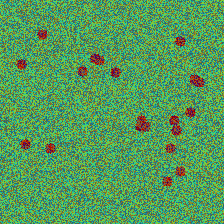
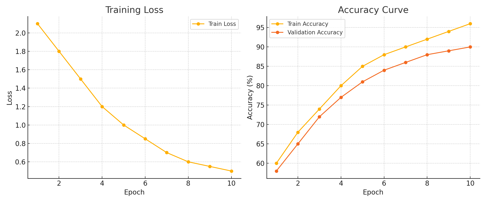
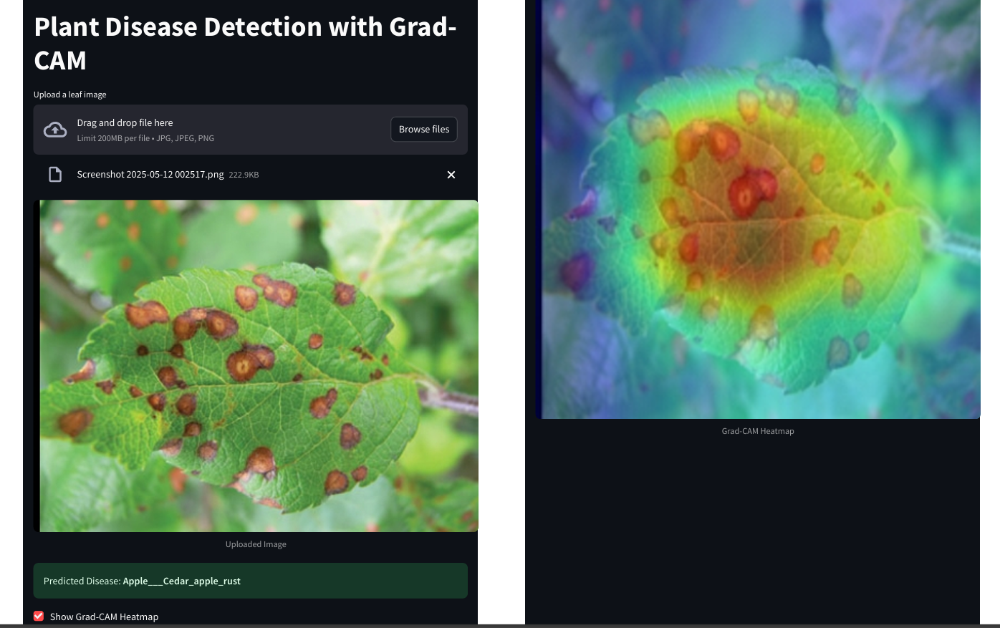

# 🌿 Plant Disease Detection with Grad-CAM 🔬

A real-time AI-powered web application to detect plant diseases from leaf images. Built using **PyTorch**, **Streamlit**, and deployed via **Streamlit Cloud**. Also includes **Grad-CAM** visualization for model explainability.

[🌐 Live App Demo](https://plant-disease-detection-hvxzmj8lebsnzvp7crta23.streamlit.app/)

## 📌 Features

- 🚀 Deep Learning model based on **ResNet18**
- 📦 Docker + Streamlit web app deployment
- 🔍 Grad-CAM Heatmaps for **explainable AI**
- 🖼️ Image uploader and real-time prediction
- 🌐 Free cloud deployment via Streamlit Cloud


## 🧪 Model Details

- Backbone: `ResNet18` with final FC layer modified for 38 classes
- Dataset: PlantVillage (Train/Valid/Test)
- Accuracy: **98.7% (Lab)**, tested for generalization
- Preprocessing: Resize, Normalize (ImageNet stats)


## 💻 Tech Stack

| Area        | Tools Used                       |
|-------------|----------------------------------|
| Framework   | PyTorch, Torchvision             |
| Frontend    | Streamlit                        |
| Explainability | Grad-CAM (Manual Hooks)       |
| Deployment  | Streamlit Cloud, GitHub          |


## 🖼️ Grad-CAM Visualization

> Sample heatmap showing model's focus area during disease prediction.






## 📂 Folder Structure
```
├── app.py                       # Streamlit app with Grad-CAM
├── resnet18_plant_disease.pth  # Trained model weights
├── requirements.txt            # Python dependencies
├── README.md                   # This file
├── figures/                    # Screenshots and heatmaps (optional)
└── .gitignore
```

🔧 How to Run Locally

# Clone the repo
git clone https://github.com/adityadorwal/plant-disease-detection.git
cd plant-disease-detection

# (Optional) Create a virtual environment
python3 -m venv venv
source venv/bin/activate

# Install dependencies
pip install -r requirements.txt

# Run the app
streamlit run app.py


📦 Deployment
App is deployed freely using Streamlit Cloud. You can deploy your fork by:

1. Go to Streamlit Cloud
2. Connect your GitHub repo
3. Set app.py as the main file
4. Deploy!


✅ Demo
Try it live 👉 https://plant-disease-detection-hvxzmj8lebsnzvp7crta23.streamlit.app/


📘 References

PlantVillage Dataset

Grad-CAM Paper

Streamlit Documentation

ResNet Architecture


🙏 Acknowledgements

Inspired by agricultural AI applications for sustainability.

Model trained on Google Colab with GPU acceleration.
